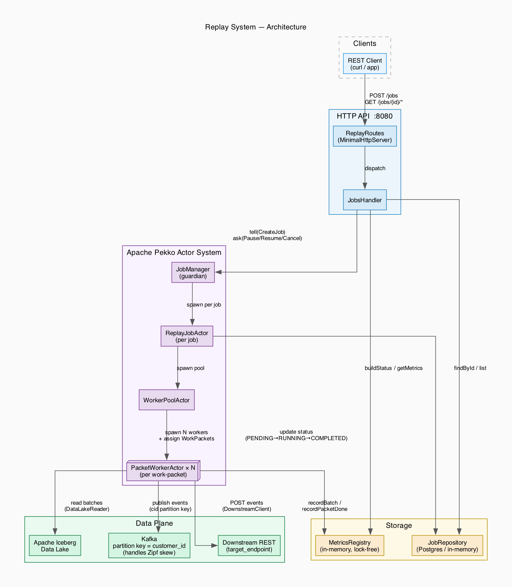

# Replay System

A high-throughput event replay engine that reads security events from an Apache Iceberg data lake and re-publishes them — at configurable speed — to both a Kafka topic and a downstream REST endpoint.



---

## Features

- **Configurable replay speed** — `speed_multiplier: 1.0` for real-time, any float for faster/slower
- **Parallel workers** — work-packets processed concurrently via Apache Pekko actors
- **Customer-keyed Kafka partitioning** — `customer_id` as partition key; handles Zipf-skewed workloads without hotspot rebalancing
- **Dual emission** — Kafka and downstream REST publish concurrently per batch
- **Pause / resume with no data loss** — checkpoint at batch-boundary granularity
- **Live metrics** — EPS sliding window, P99 latency, per-job progress and ETA
- **Pluggable storage** — in-memory (default) or Postgres job repository

---

## Quick Start

### Local JVM

```bash
# Build
mvn package -DskipTests

# Run (in-memory store, no Kafka/Postgres needed for basic testing)
./scripts/deploy.sh
```

### Kubernetes (minikube)

```bash
minikube start --memory=4096 --cpus=2
./scripts/k8s-deploy.sh
export BASE_URL=$(minikube service replay-api -n replay-system --url)
```

### Kubernetes (kind)

```bash
kind create cluster --name replay
./scripts/k8s-deploy.sh --kind
kubectl port-forward -n replay-system svc/replay-api 8080:8080
export BASE_URL=http://localhost:8080
```

See [`k8s/README.md`](k8s/README.md) for full Kubernetes setup and teardown.

---

## Usage

```bash
# Create a job
curl -X POST $BASE_URL/api/v1/replay/jobs \
  -H 'Content-Type: application/json' \
  -d '{
    "source_table":     "security_events",
    "target_topic":     "replay-output",
    "from_time":        "2024-01-01T00:00:00Z",
    "to_time":          "2024-01-02T00:00:00Z",
    "speed_multiplier": 1.0
  }'

# Monitor
curl $BASE_URL/api/v1/replay/jobs/{id}/status
curl $BASE_URL/api/v1/replay/jobs/{id}/metrics

# Control
curl -X POST $BASE_URL/api/v1/replay/jobs/{id}/pause
curl -X POST $BASE_URL/api/v1/replay/jobs/{id}/resume
curl -X POST $BASE_URL/api/v1/replay/jobs/{id}/cancel
```

Full API reference: [`docs/API.md`](docs/API.md)

---

## Architecture

```
REST Client
    │
    ▼
ReplayRoutes (HTTP :8080)
    │
    ▼
JobsHandler
    ├── JobRepository  (Postgres / in-memory)
    └── MetricsRegistry (lock-free, in-process)
    │
    ▼
JobManager  [Pekko guardian]
    └── ReplayJobActor  [per job]
            └── WorkerPoolActor
                    └── PacketWorkerActor × N
                            ├── DataLakeReader  →  Apache Iceberg
                            ├── KafkaEventPublisher  →  Kafka (key = customer_id)
                            └── DownstreamClient     →  target REST endpoint
```

### Partitioning Strategy

Each event carries a `customer_id` (`cid`). `PacketWorkerActor` passes `cid` as the Kafka record key, so all events belonging to one customer land on the same partition. This preserves per-customer ordering and avoids hotspot rebalancing even when workloads are Zipf-distributed (a single "whale" customer driving ≥ 80 % of events).

### Actor Hierarchy

| Actor | Role |
|-------|------|
| `JobManager` | Guardian; spawns one `ReplayJobActor` per job, handles `WorkerFinished` |
| `ReplayJobActor` | Plans work-packets, spawns `WorkerPoolActor`, updates job status in repo |
| `WorkerPoolActor` | Manages N concurrent `PacketWorkerActor`s; propagates pause/resume/cancel |
| `PacketWorkerActor` | Reads → publishes one `WorkPacket`; checkpoints at batch boundaries |

### Pause / Resume

Workers only enter `WAITING_RESUME` after the current batch's publish completes. On resume the worker continues from `batchIndex + 1`. This guarantees exactly-once batch processing with no re-sends or gaps across any number of pause/resume cycles.

---

## Configuration

| Env variable | Default | Description |
|---|---|---|
| `HTTP_PORT` | `8080` | HTTP listen port |
| `POSTGRES_URL` | — | JDBC URL; omit for in-memory store |
| `POSTGRES_USER` | — | Postgres username |
| `POSTGRES_PASSWORD` | — | Postgres password |
| `KAFKA_BOOTSTRAP_SERVERS` | `localhost:9092` | Kafka brokers |
| `ICEBERG_WAREHOUSE_URI` | `./data/iceberg-warehouse` | Iceberg warehouse root |
| `JAVA_OPTS` | — | Extra JVM flags |

---

## Project Layout

```
replay-system/
├── src/
│   ├── main/java/com/example/replay/
│   │   ├── actors/          # Pekko actor hierarchy
│   │   ├── api/             # HTTP handlers and routing
│   │   ├── datalake/        # Iceberg DataLakeReader
│   │   ├── downstream/      # REST DownstreamClient
│   │   ├── kafka/           # KafkaEventPublisher
│   │   ├── metrics/         # MetricsRegistry, JobMetricsState
│   │   ├── model/           # Domain records (ReplayJob, JobStatus, …)
│   │   ├── storage/         # JobRepository (Postgres + in-memory)
│   │   └── tools/           # DataGenerator (seed tool)
│   └── test/
├── k8s/                     # Kubernetes manifests (Kustomize)
├── scripts/
│   ├── deploy.sh            # Local JVM deploy
│   ├── k8s-deploy.sh        # One-script k8s deploy (minikube / kind)
│   └── generate-data.sh     # Seed Iceberg data
├── docs/
│   ├── API.md               # Full API reference
│   ├── DEMO.md              # 20-minute demo walkthrough
│   └── architecture.png     # System architecture diagram
└── Dockerfile
```

---

## Development

```bash
# Run all tests
mvn test

# Run a specific test class
mvn test -Dtest=FailoverTest

# Build Docker image
docker build -t replay-system:latest .
```

---

## Documentation

- [`docs/DESIGN.md`](docs/DESIGN.md) — system design document (architecture, API, data strategy, trade-offs)
- [`docs/API.md`](docs/API.md) — complete API reference
- [`docs/DEMO.md`](docs/DEMO.md) — 20-minute live demo script
- [`k8s/README.md`](k8s/README.md) — Kubernetes setup, smoke tests, teardown
